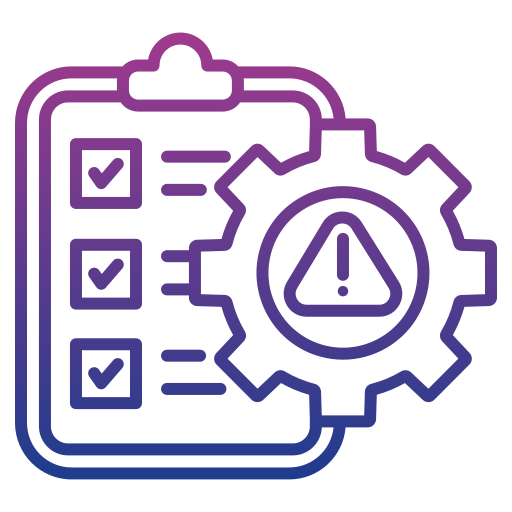

<p align="center">
  <a href="" rel="noopener">
 </a>
</p>

<h3 align="center">CTF Writeups </h3>


<div align="center">

[]()
[](https://github.com/Salvatore-Rendo/CTFWriteUps/issues)
[](https://github.com/Salvatore-Rendo/CAL-Cyber-Attacks-List/pulls)
[](/LICENSE)

</div>

---

<p align="center"> A list of some CTF Writeups done by me.
    <br> 
</p>

## 📝 Table of Contents

- [📝 Table of Contents](#-table-of-contents)
- [🧐 About ](#-about-)
- [📋 CTF Writeups List ](#-ctf-writeups-list-)
- [🎈 Usage ](#-usage-)
- [⛏️ Software Used ](#️-software-used-)
- [✍️ Authors ](#️-authors-)


## 🧐 About <a name = "about"></a>

List of some CTF Writeups done by [@Salvatore-Rendo](https://github.com/Salvatore-Rendo)

## 📋 CTF Writeups List <a name = "ctf_list"></a>

| Name | Website | Writeups |
| :--- | :---: | :--- |
|Olicyber Training CTF | [Website](https://training.olicyber.it/) | [Writeups](/olicyber-training/main.md) |
|Pwn College | [Website](https://pwn.college/) | [Writeups](/pwn-college/main.md) |
|TryHackMe: Advent of Cyber | [Website](https://tryhackme.com/room/adventofcyber2023) | [Writeups](/advent-of-cyber/main.md) |

## 🎈 Usage <a name="usage"></a>

Click the relative [CTF Writeups List ](#-ctf-writeups-list-) writeup link.
Or nagivate to the selected CTF folder and open the relative:
```
main.md
```

## ⛏️ Software Used <a name = "software_used"></a>

- [Wireshark](https://www.wireshark.org/) - Network Protocol Analyzer
- [Python](https://www.python.org/) - Scripting Language
- [Ghidra](https://ghidra-sre.org/) - Software Reverse Engineering tool
- [Burpsuite](https://portswigger.net/burp) - Web Application Security Testing Tool
- [Flaticon](https://www.flaticon.com/) Icon


## ✍️ Authors <a name = "authors"></a>

- [@Salvatore-Rendo](https://github.com/Salvatore-Rendo) - Idea & Initial work


